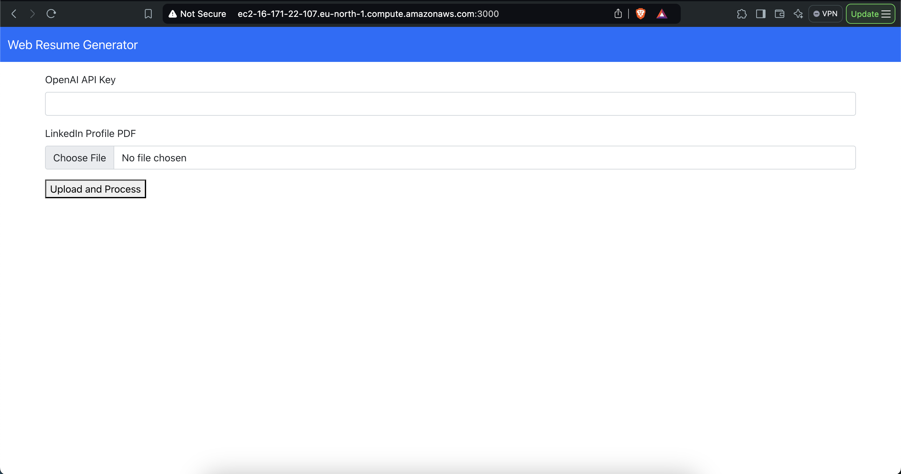
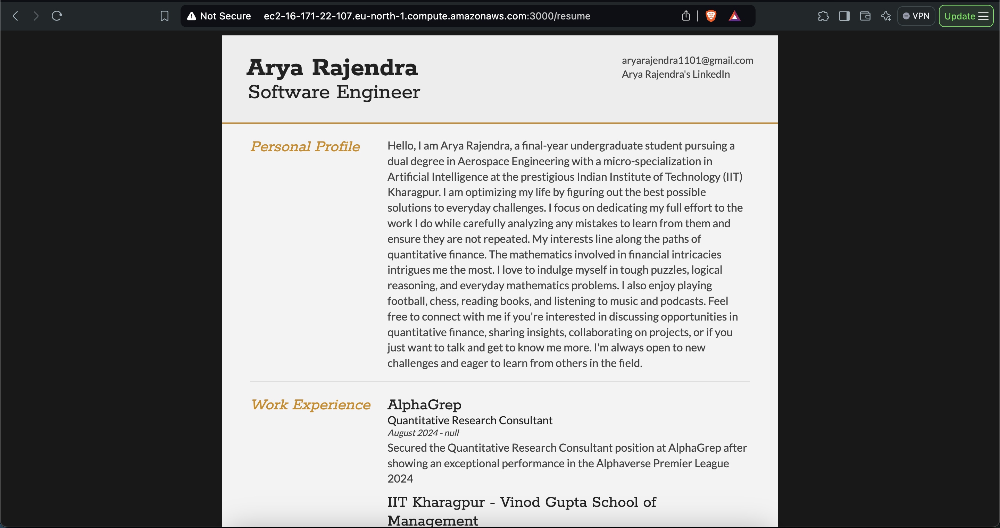

# HTML Resume Generator

This project consists of a **React** frontend and a **FastAPI** backend. The entire application is containerized using **Docker** to simplify setup and deployment.

[DEMO](http://ec2-16-171-22-107.eu-north-1.compute.amazonaws.com:3000/)

## Screenshots
<table>
  <tr>
    <td style="text-align:center;">
      
    </td>
    <td style="text-align:center;">
      
    </td>
  </tr>
</table>

## Prerequisites

- Install [Docker](https://docs.docker.com/get-docker/) on your machine.
- Install Docker Compose on your machine

## Running the Project

1. Clone the repository:
   ```bash
   git clone https://github.com/your-username/WebResumeGenerator.git
   cd WebResumeGenerator
   ```
2. Build the Docker images for the frontend and backend:
    ```bash
    docker compose build
    ```
3. Run the Docker containers:
    ```bash
    docker compose up
    ```
4. The frontend will be accessible at http://localhost:3000
5. The backend will be accessible at http://localhost:8000

## Frontend
For more details on the frontend, refer to the [Frontend README]().

## Backend
For more details on the backend, refer to the [Backend README]().
